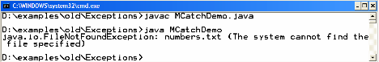
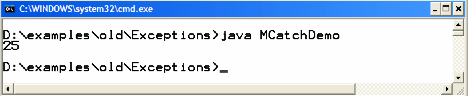
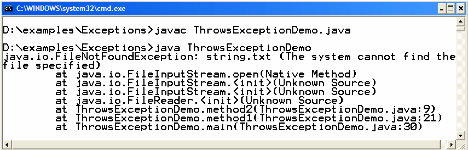
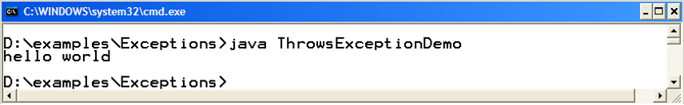

# Lab 2: Exception Handling (II)

---

- **Course Name:** Advanced Programming
- **Course Code:** CPIT-305
- **Course Instructor:** Dr. Rayan Mosli

---

## Multiple catch blocks
Possible to have multiple catch clauses for a single try statement
- Evaluated in the order of the code
  – Bear in mind the Exception hierarchy when writing multiple catch clauses!

#### Example

```java

/* numbers.txt contains numbers. After reading number from file, prints its square on console  */

import java.io.*;

public class MCatchDemo {
    public static void main(String args[]) {
        try {
            // may throw FileNotFound & IOException
            FileReader fr = new FileReader("numbers.txt");
            BufferedReader br = new BufferedReader(fr);
            // read the line
            String s = br.readLine();
            // may throw NumberFormatException, if s is not no.
            int number = Integer.parseInt(s);
            System.out.println(number * number);
        } catch (NumberFormatException nfEx) {
            System.out.println(nfEx);
        } catch (FileNotFoundException fnfEx) {
            System.out.println(fnfEx);
        } catch (IOException ioEx) {
            System.out.println(ioEx);
        } finally {
            br.close();
        }
    }
}

```

We read everything from a file (numbers, floating values or text) as a String. That’s why we first convert it to numb and then print its square on console.

#### Compile & Execute
If file numbers.txt is not present in the same directory, the FileNotFoundException would be thrown during execution.

```shell
javac MCatchDemo.java
```



If numbers.txt present in the same directory and contains a number, than hopefully no exception would be thrown.

```shell
java MCatchDemo.java
```




## `throws`clause

- If method is not interested in handling the exception than it can throw back the exception to the caller method using `throws` keyword.
- Any exception that is thrown out of a method must be specified as such by a `throws` clause.

The following code examples will introduce you with writing & using throws clause.

```java
// File ThrowsDemo.java

import java.io.*;

public class ThrowsDemo {
    // contains file reading code
    public static void method2() {
        try {
            FileReader fr = new FileReader("strings.txt");
            BufferedReader br = new BufferedReader(fr);
            //read the file line by line
            String s = br.readLine();
            System.out.println(s);
        } catch (IOException ioEx) {
            ioEx.printStackTrace();
        }
    }

    public static void method1() {
        method2();
    }

    public static void main(String args[]) {
        ThrowsDemo.method1();
    }
}
```
#### Example Code: `ThrowsDemo.java`

The ThrowsDemo.java contains two methods namely method1 & method2 and one main method. The main method will make call to method1 and than method1 will call method2. The method2 contains the file reading code. The program looks like one given below

```java
// File ThrowsDemo.java

import java.io.*;

public class ThrowsDemo {
    // contains file reading code
    public static void method2() throws IOEception {
        FileReader fr = new FileReader("strings.txt");
        BufferedReader br = new BufferedReader(fr);
        //read the line form file
        String s = br.readLine();
        System.out.println(s);
    }

    // calling method2 & handling incoming exception
    public static void method1() {
        try {
            method2();
        } catch (IOException ioEx) {
            ioEx.printStackTrace();
        }
    }

    public static void main(String args[]) {
        ThrowsDemo.method1();
    }
}


#### Compile & Execute
If file strings.txt is not present in the same directory, method2 will throw an exception that would be caught by method1 and the printStackTrace method will print the full calling history on console. The above scenario is shown in the output below:

```shell
javac ThrowsDemo.java
java ThrowsDemo
```

If file strings.txt exist there, then hopefully a line would be displayed on the console.




## `throw` 

To manually throw an exception, keyword `throw` is used. 

#### Exercise Solution:

```java
import javax.swing.*;

public class Main {


    public static void main(String[] args) {
        // TODO code application logic here
        JOptionPane j = new JOptionPane();

        String in = j.showInputDialog("Enter number to power it:");
        int x;

        try {
            x = Integer.parseInt(in);
            System.out.println(x + " * " + x + " = " + Power(x));
        } catch (OutOfRange e) {
            System.err.println(e.getMessage());
        } catch (NumberFormatException e) {
            System.err.println(e.getMessage());
        }finally {
            System.out.println("This is Finally Block");
        }
        System.out.println("This is Next Statement");
    }

    public static int Power(int x) throws OutOfRange {
        if (x &lt; 0 || x &gt; 100) {
            throw new OutOfRange(0, 100);
        }
        return x * x;
    }

}

class OutOfRange extends Exception {

    private int min;
    private int max;
    public OutOfRange(int min, int max) {
        this.min = min;
        this.max = max;
    }

    @Override
    public String getMessage() {
        return "Number must be between " + min + " and " + max;
    }
}

```

#### Exercise:

Write a program in java that takes in a value from a user to find the square of an integer from 0 to 100. If the value is not an integer or within the range, then print the exception. To handle the outOfRange exception, create a custom exception class that can be thrown in case a number is out of range.


## Submission

[Submit using the following GitHub classroom link](#)

## How to submit your lab to GitHub Classroom

[This video demonstrates how to submit your work to GitHub classroom](https://www.youtube.com/embed/--x1yIj44-o)
